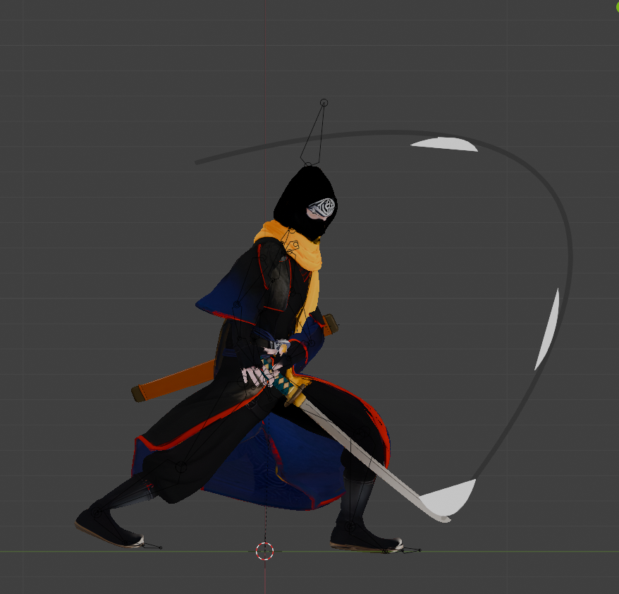
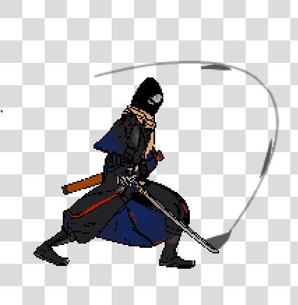

# Blender Pixel Art Denoiser

[](https://github.com/Renoned/blender-pixel-seq/releases)
[](https://www.blender.org/)
[](LICENSE)
[](https://github.com/Renoned/blender-pixel-seq)

一个用于生成像素风动画序列的 Blender 插件，重点是**批量帧一致性**和**可控去噪**。

English version: `README_EN.md`

## 效果对比

### 建模原始视图



### 插件处理后预览



## 为什么做这个插件

- 动画序列比单张图更难，常见问题是闪烁、黑边、脏点和亮度漂移。
- 这个插件目标是保持「一键流程」：渲染 -> 网格像素化 -> 去锯齿 -> 量化 -> 可选描边 -> 导出。
- 适合做游戏角色动作帧、技能特效帧、敌人动画序列。

## 功能特性

- `一键处理`：按时间轴批量处理所有帧
- `材质转纯净赛璐璐`：偏向硬阴影、减少白膜和噪点来源
- `边缘/黑像素修复`：优先保护轮廓，不误伤内部暗部
- `颜色量化`：限制色板，保留像素风块面感
- `预览 + 导出`：在 Blender 内快速查看并导出序列

## 安装

### 方法 1（推荐）：Release 安装

1. 打开 Releases 页面：`https://github.com/Renoned/blender-pixel-seq/releases`
2. 下载最新版本压缩包
3. Blender -> `编辑` -> `偏好设置` -> `插件` -> `安装...`
4. 选择 zip，启用 `Pixel Art Denoiser`

### 方法 2：源码安装

将仓库目录复制到 Blender 插件目录：

- Windows: `%APPDATA%/Blender Foundation/Blender/<版本>/scripts/addons/`
- macOS: `~/Library/Application Support/Blender/<版本>/scripts/addons/`
- Linux: `~/.config/blender/<版本>/scripts/addons/`

然后重启 Blender 或执行 `F3 -> Reload Scripts`。

## 快速开始（60 秒）

1. 在 3D 视图右侧打开 `像素艺术` 面板。
2. 可选预处理：
   - `一键生成标准像素光照`
   - `一键消除模型反光`
   - `一键材质转纯净赛璐璐 (保留颜色)`
3. 设置核心参数：输出路径、分辨率、像素大小、阈值、颜色数。
4. 点击 `一键处理`。
5. 点击 `预览效果`，满意后 `输出图像`。

## 推荐参数（起步）

- 分辨率：`256x256`（或更低）
- 关闭抗锯齿：`开启`
- 像素大小：`3 ~ 5`
- 最大颜色：`12 ~ 24`
- 描边：角色轮廓复杂时再开启

## 依赖说明

- Blender 3.6+
- Pillow
- NumPy
- scikit-learn（可选，缺失时会自动回退到 Pillow 量化）

```bash
pip install -r requirements.txt
```

## 项目路线图

- [ ] 增加示例素材与效果对比图
- [ ] 输出参数预设（角色/特效/环境）
- [ ] 更细粒度的高级参数（保持默认简单）

## 贡献

欢迎提交 Issue / PR，一起把这套动画像素化流程做得更稳。

- 贡献指南：`CONTRIBUTING.md`
- 更新日志：`CHANGELOG.md`

## 许可证

MIT License

## 致谢

- [pixfix](https://github.com/lovelaced/pixfix)
- [Lospec Blender Toolkit](https://github.com/lospec/lospec-blender-toolkit)
